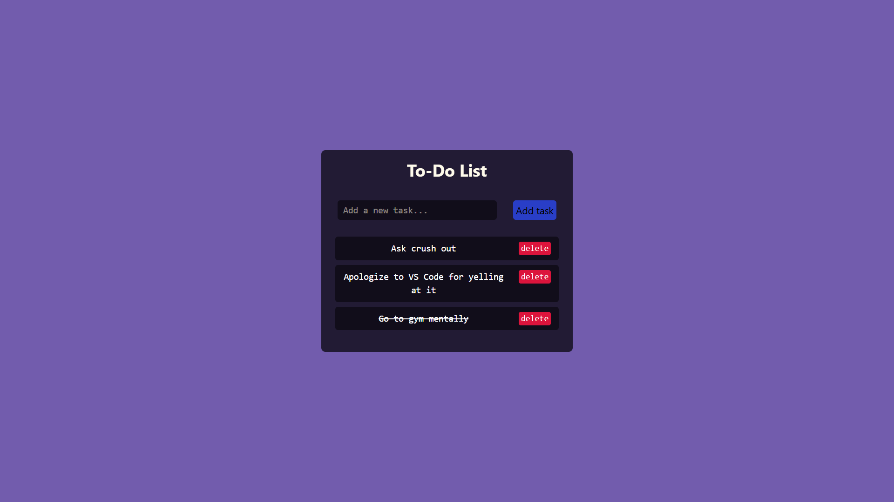
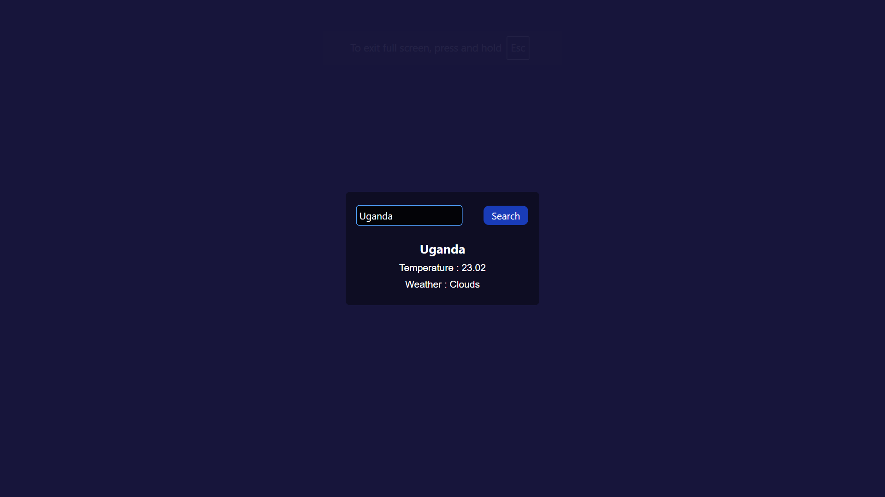

# ⚙️ Mini Web Projects by Ariyan Jadhav

A growing collection of **responsive and interactive web apps** made using **HTML, Tailwind-CSS, and Vanilla JavaScript**.  
These mini projects are designed to explore core frontend concepts, solve real-world UI problems, and practice clean code structure.

Each project includes:
- 🔧 Functionality (real logic using JS)
- 💅 Responsive design (works on mobile)
- 💡 Beginner-friendly code

---

## 📸 App Previews

| App           | Preview                          |
|---------------|----------------------------------|
| ✅ To-Do App   |    |
|                |                                  |
| 🌦️ Weather App| |

> _All previews are from real screenshots of the apps included in this repo._

---

## 🧰 Tech Stack

- HTML5  
- CSS (Tailwind)  
- JavaScript (DOM manipulation, APIs, LocalStorage)  
- REST APIs (like OpenWeather)  
- Responsive design principles
